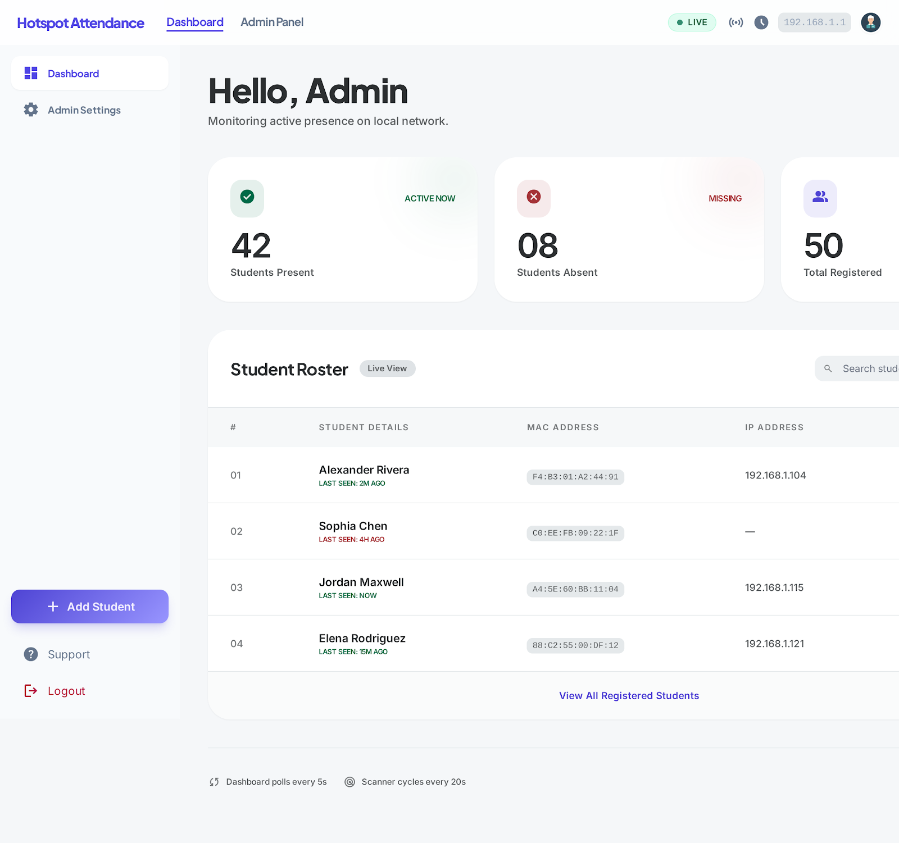

# 📡 WiFi Attendance System

An automated, high-performance, and real-time attendance tracking ecosystem designed for local networks. 

Built with the sleek **"Kinetic Pulse"** design system, this tool dynamically manages student presence over a WiFi hotspot by continuously monitoring hardware capabilities (MAC/IP resolution) via a lightweight Python daemon.



## ✨ Core Features

* **Automated Polling Engine**: A powerful background daemon thread executes system-level ARP scanning to silently and securely monitor network topology.
* **Smart Attendance Logic**: 
  * Automatically calculates session duration.
  * Dynamically categorizes students as **Present**, **Partial** (e.g. connected for a short period), or **Absent**.
* **"The Kinetic Pulse" UI**: An ultra-premium interface avoiding harsh dark themes in favor of an airy, minimalist aesthetic with glassmorphism, contextual status pills, and editorial spacing.
* **Admin Framework**: Control panel featuring "Quick Enroll" capabilities specifically designed to handle unrecognized devices actively connected to the hotspot.
* **Dual-State Database**: Engineered on SQLite to maintain lightweight, permanent audit archives alongside ephemeral active session states.

---

## 🛠 Tech Stack

* **Backend Framework:** [FastAPI](https://fastapi.tiangolo.com/) (High-performance Async Python)
* **Server:** Uvicorn
* **Database:** SQLite3
* **Frontend:** Vanilla HTML5, CSS3, & Modern JS (Fetch API) — No external bloat.
* **Network Interfacing:** Raw OS-level `arp` daemon threads.

---

## 🚀 Getting Started

### Prerequisites
* **Python 3.8+** installed on a Windows Environment (relies on `arp -a`).
* Administrator/Elevated privileges (Required to manage the IP/ARP cache properly).

### 1. Installation

Clone this repository and navigate to the project directory:
```bash
git clone https://github.com/yourusername/WiFi-Attendance-System.git
cd WiFi-Attendance-System
```

### 2. Install Dependencies

Install the required Python modules:
```bash
pip install -r requirements.txt
```

### 3. Launching the Network Monitor

Ensure you run the terminal or command prompt as an **Administrator**. Start the FastAPI server:

```bash
python main.py
```

### 4. Accessing the Pulse
* **Dashboard (Live View):** Open your browser and navigate to `http://127.0.0.1:8000`
* **Admin Settings:** Navigate to `http://127.0.0.1:8000/admin` to begin adding hardware entries to your student registry.

---

## 🏗 Project Structure

```text
📦 WiFi-Attendance-System
 ┣ 📂 design/              # UI/UX References & The Kinetic Pulse guidelines
 ┣ 📜 main.py              # Application core, FastAPI routing & database init
 ┣ 📜 hotspot.py           # Daemon logic for background network polling
 ┣ 📜 dashboard.html       # The live graphical monitor
 ┣ 📜 admin.html           # Comprehensive admin configuration panel
 ┣ 📜 requirements.txt     # Dependency definitions
 ┗ 📜 README.md
```

## 🔒 Limitations & Notes
* This system is explicitly designed for local gateway monitoring and relies heavily on OS-level `arp` execution. Modifying this for Unix systems will require updating the regex logic in the network scanner layer.
* IP Addresses are assigned via DHCP; the system strictly tracks identities using the unalterable **MAC Address**.

---
*Architected and developed with focus on clean layouts, scalable performance, and pure utility.*
