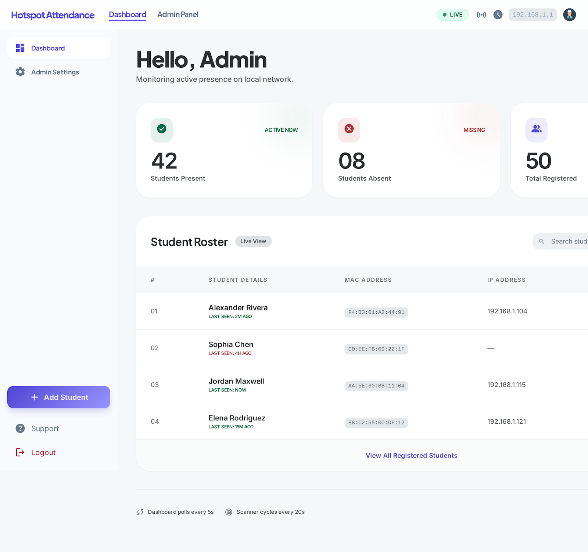

# 📡 WiFi Attendance System

An automated, high-performance, and real-time attendance tracking ecosystem designed for local networks. 

Built with a sleek, minimalist design, this tool dynamically manages student presence over a WiFi hotspot by continuously monitoring hardware capabilities (MAC/IP resolution) via a lightweight Python daemon.

---

## 📖 Documentation
- **[Integration Guide](integration.md)**: A deep dive into the project architecture, `main.py` logic, and how the frontend and backend are integrated with code examples.
- **[Changelog](changelog.md)**: Record of project updates and bug fixes.

---

## 🚀 Getting Started

### Prerequisites
* **Windows Environment**: Relies on `ipconfig` and `arp -a` commands.
* **Python 3.8+**
* **Administrator Privileges**: Required to run the scanner and manage network caches.

### Installation
1.  **Clone the repository**.
2.  **Install dependencies**: `pip install -r requirements.txt`
3.  **Run the application**: `python main.py` (Run as Administrator)
4.  **Access the UI**: 
    - Dashboard: `http://localhost:5000/dashboard`
    - Admin: `http://localhost:5000/admin`

---

## 📜 Project Structure
- `main.py`: Application core, FastAPI routing, and background scanner.
- `dashboard.html`: Real-time monitoring interface.
- `admin.html`: Student management and timer configuration.
- `attendance.db`: SQLite database (auto-generated).
